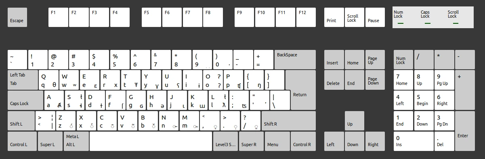

# **Salishan Languages Keyboard Support**

**Salishan** is a **keyboard layout for Salishan and neighboring Indigenous languages of the Pacific Northwest**. It extends the standard English keyboard with **dead keys for glottalization, acute accent, tilde, and other diacritics**, enabling efficient typing of **ejective, glottalized, and lateral consonants**, as well as **special vowels** used across multiple Salishan languages. The layout also includes **combining diacritics for rare tonal or phonetic markings**, making it a comprehensive tool for **linguists, language learners, and community members**.

A guiding principle behind this keyboard is **flexibility**. Many people today speak or write in multiple languages at the same time—especially in messaging apps. With this layout, you can **type in Spokane Salish, English, or other supported languages without switching keyboards** or interrupting the flow of conversation.

For example, you might chat with friends in Spokane Salish while also messaging relatives who use only English. The **Salishan Keyboard** keeps the transition between both conversations smooth by preserving the full English keyboard and adding Salishan features only when you need them.
